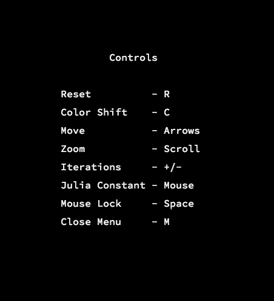
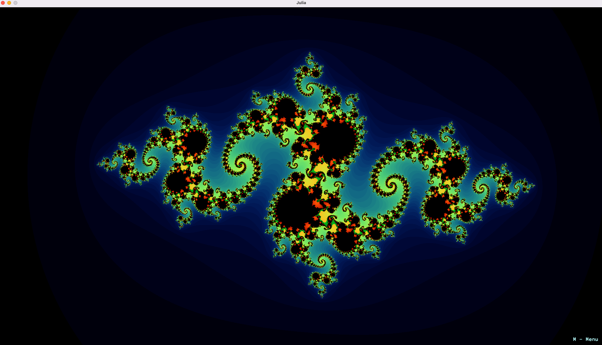
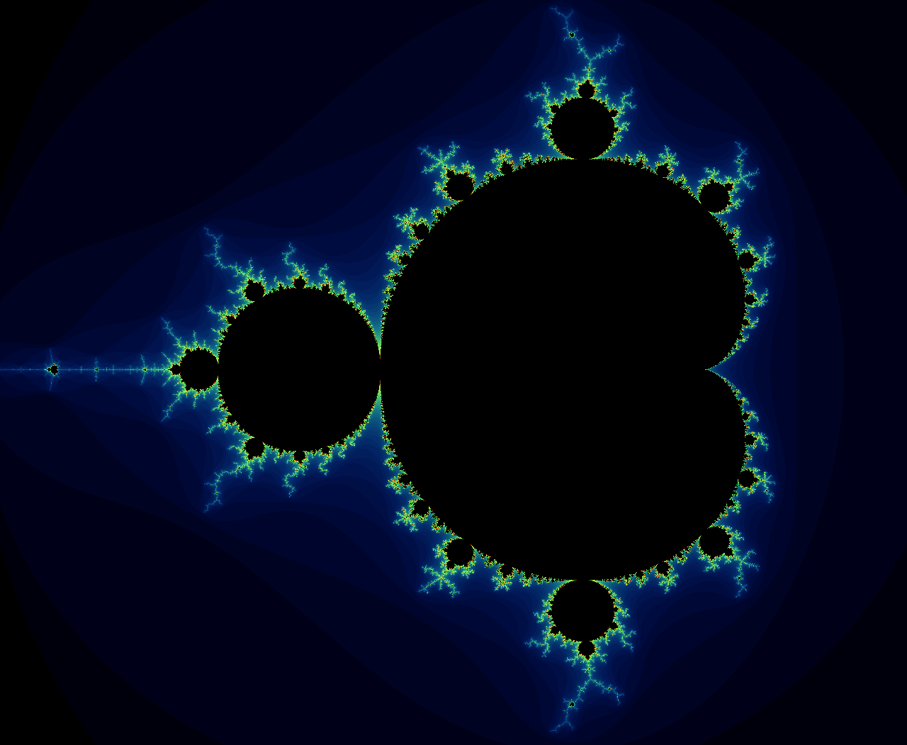
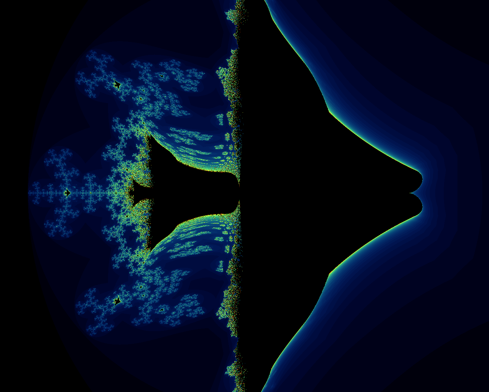
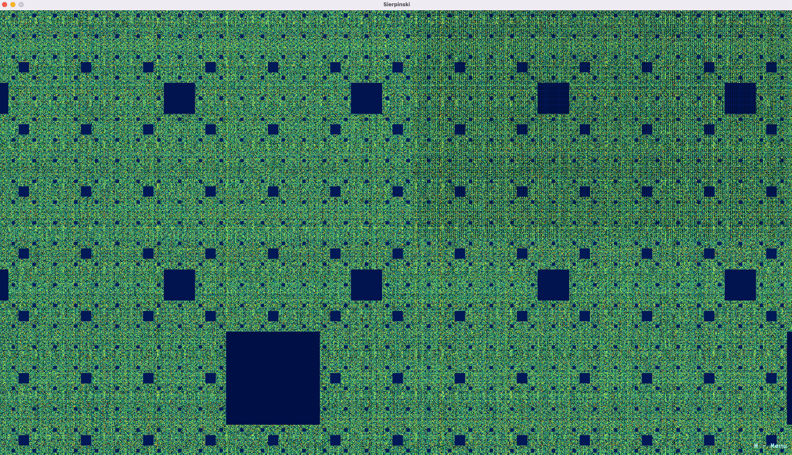

  <a name="readme-top"></a>

<!-- PROJECT LOGO -->
<br />
<div align="center">
  <a href="https://github.com/conu101/fractol">
    
  </a>

  <h3 align="center">Fract'ol | interactive visualization of fractals with multithreading </h3>
  <br />
  <br />
  <br />
  <br />
</div>


<!-- TABLE OF CONTENTS -->
<details>
  <summary>Table of Contents</summary>
  <ol>
    <li>
      <a href="#about-the-project">About The Project</a>
      <ul>
        <li><a href="#built-with">Built With</a></li>
      </ul>
    </li>
    <li>
      <a href="#getting-started">Getting Started</a>
      <ul>
        <li><a href="#installation">Installation</a></li>
      </ul>
    </li>
    <li><a href="#usage">Usage</a></li>
    <li><a href="#roadmap">Roadmap</a></li>
    <li><a href="#contact">Contact</a></li>
    <li><a href="#acknowledgments">Acknowledgments</a></li>
  </ol>
</details>


<!-- ABOUT THE PROJECT -->
## About The Project

  <a href="https://github.com/conu101/fractol">
    
  </a>

Continuing after FdF with the graphical library miniLibX, it’s time to light all the pixels of the screen and create some sweet visuals!
This project will was for me the opportunity to hone my miniLibX skills with an array of UI events and color management, to use the mathematical 
notion of complex numbers and to take a peek at the concept of optimization in computer graphics with the implementation of multithreading.


The program displays the following fractals, called as an argument at run time:

* Julia set
* Mandelbrot set
* Celtic Mandelbrot
* Sierpinski's carpet

If the program is run without an argument, the correct usage will be displayed in stdout.

The program opens a window and projects an image drawn according to te fractal set called as an argument. The image is defined as a set of data addresses for each pixel.

The formula is slightly different for each fractal, with a maximum of 100 iterations, which allows to zoom in deep in the fractals. Julia set's parameters can be modified 
by the useer during run time with the mouse. 
All UI options are detailed in a menu controlled by the keypress M:

<a href="https://github.com/conu101/Fractol">
    
</a>

  <br />
  <br />
  <br />

Julia set

<a href="https://github.com/conu101/Fractol">
    
</a>

  <br />
  <br />
  <br />

Mandelbrot set

<a href="https://github.com/conu101/FdF">
    
</a>

  <br />
  <br />
  <br />

Celtic Mandelbrot set

<a href="https://github.com/conu101/FdF">
    
</a>
a
  <br />
  <br />
  <br />

Sierkinspi carpet

-> This set, chosen as an option, uses only real numbers and o imaginary ones unlike the previous sets.

<a href="https://github.com/conu101/FdF">
    
</a>

  <br />
  <br />
  <br />


The main steps to succeed in the Fractol project were:

personal: 
* although this project was more demanding tha the previous one, I found the learning curve more manageable than for FdF because the graphics interface was a familiar tool and the topic was passinating.

technical:
* familiarisation with complex numbers, research of the equations allowing to draw each set of fractals.
* creation of an image through data address of pixels.
* coding the colors shifts accompanying the fractals iterations, use of RGBA channels.
* first steps with multithreading. Use of library pthread.h in the draw_fractal() function.

This project was full of teachings and also aesthetically pleasing!


### Built With

* [![C][C.js]][C-url]
* [![VS-Code][VS-Code.js]][VSCode-url]
* [![minilibx][minilibx.js]][minilibx-url]


<!-- GETTING STARTED -->
## Getting Started

The project can be set up locally by downloading or cloning the repository. It has been built on and for macos so its functionality is not guaranteed on other operating systems.

The project required the use of the static library libft.a coded during the previous project. The libft version used in this projct is the version I had put together in that time, much more limited than the currently available version that has been updated since.
See libft project -> [https://github.com/conu101/libft](https://github.com/conu101/libft)

The graphics library minilibx is included in this repository (macos version) and will be compiled with the project by the makefile.

The executable "fractol" is available in this repo for direct use, but the project can also be recompiled following the steps presented next. If you use the available executable from this repo, ignore steps 4 and 5.

### Installation

1. Open a terminal on your machine

2. Clone the repo
   ```sh
   git clone https://github.com/conu101/Fractol.git <your_local_repository>
   ```
3. Get in your new repository
   ```sh
   cd <your_local_repository>
   ```
4. Compile the project using the Makefile
   ```sh
   make
   ```
5. Check that the executable <fdf> was created and delete the object files
   ```sh
   make clean
   ```
6. Run the executabe with one of the fractal names as argument 
	```sh
	./fractol Julia
	```
<p align="right">(<a href="#readme-top">back to top</a>)</p>


<!-- USAGE EXAMPLES -->
## Usage

   Julia set

	user@usermachine fractol_git % ./fractol Julia

At the opening the Julia fractal is locked. In the following video I unlocked with "space" and moved the mouse around to modify Julia's parameters:
The behavious of the picture is shown in images/video_short_julia.mov

  <br />
  <br />

   Mandelbrot set

	user@usermachine fractol_git % ./fractol Mandelbrot

	or

	user@usermachine fractol_git % ./fractol "Celtic Mandelbrot"


  <br />
  <br />

   Sierpinski carpet

	user@usermachine fractol_git % ./fractol Sierpinski

 <br />
 <br />
The images/ folder contains short videos of the other fractals during zoom in, feel free to check it out as well.

  <br />
  <br />
  <br />

<!-- ROADMAP -->
## Roadmap

- [x] Open window and draw a pixel with minilibx
- [x] Code the 4 different equations in iterate_fractals.c
- [x] Set up the draw() function with multithreading and pick a well-suited color theme for beautiful psychedelic effects
- [x] Code the events as hooks
    - [x] from keyboard
    - [x] from mouse


<!-- CONTACT -->
## Contact

Constance Trouvé - firstname.name(at)gmail.com

Project Link: [https://github.com/conu101/Fractol](https://github.com/conu101/Fractol)


<!-- ACKNOWLEDGMENTS -->
## Acknowledgments

Illustrations obtained from "The Noun Project", credits:
* "Mandelbrot Fractal" by Christian Frost from <a href="https://thenounproject.com/browse/icons/term/mandelbrot-fractal/" target="_blank" title="Mandelbrot Fractal Icons">Noun Project</a>

* "fractal" by Bohdan Burmich from <a href="https://thenounproject.com/browse/icons/term/fractal/" target="_blank" title="fractal Icons">Noun Project</a>

* "fractal" by Ben Byford from <a href="https://thenounproject.com/browse/icons/term/fractal/" target="_blank" title="fractal Icons">Noun Project</a>

* "Mandala" by Brad A from <a href="https://thenounproject.com/browse/icons/term/mandala/" target="_blank" title="Mandala Icons">Noun Project</a>

* "fractal" by Alena Artemova from <a href="https://thenounproject.com/browse/icons/term/fractal/" target="_blank" title="fractal Icons">Noun Project</a>

"C", "VSCode" and "mlx" badges from <a href="https://img.shields.io" target="_blank" title="badges">img.shields.io</a>

README template by Othneil DREW from <a href=https://github.com/othneildrew/Best-README-Template target="_blank" title="git">Git_README_template</a>

<p align="right">(<a href="#readme-top">back to top</a>)</p>


<!-- MARKDOWN LINKS & IMAGES -->
<!-- https://www.markdownguide.org/basic-syntax/#reference-style-links -->
[contributors-shield]: https://img.shields.io/github/contributors/othneildrew/Best-README-Template.svg?style=for-the-badge
[contributors-url]: https://github.com/othneildrew/Best-README-Template/graphs/contributors
[forks-shield]: https://img.shields.io/github/forks/othneildrew/Best-README-Template.svg?style=for-the-badge
[forks-url]: https://github.com/othneildrew/Best-README-Template/network/members
[stars-shield]: https://img.shields.io/github/stars/othneildrew/Best-README-Template.svg?style=for-the-badge
[stars-url]: https://github.com/othneildrew/Best-README-Template/stargazers
[issues-shield]: https://img.shields.io/github/issues/othneildrew/Best-README-Template.svg?style=for-the-badge
[issues-url]: https://github.com/othneildrew/Best-README-Template/issues
[license-shield]: https://img.shields.io/github/license/othneildrew/Best-README-Template.svg?style=for-the-badge
[license-url]: https://github.com/othneildrew/Best-README-Template/blob/master/LICENSE.txt
[linkedin-shield]: https://img.shields.io/badge/-LinkedIn-black.svg?style=for-the-badge&logo=linkedin&colorB=555
[linkedin-url]: https://linkedin.com/in/othneildrew
[product-screenshot]: images/screenshot.png
[C.js]: https://img.shields.io/badge/C--programming-C-blue
[C-url]: https://www.w3schools.com/c/c_intro.php
[VS-Code.js]: https://img.shields.io/badge/Visual%20Studio%20Code-VSC-blue
[VSCode-url]: https://code.visualstudio.com/
[minilibx.js]: https://img.shields.io/badge/mlx-MiniLibX-orange
[minilibx-url]: https://harm-smits.github.io/42docs/libs/minilibx
